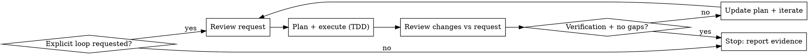

# Loop Until Done

## Overview
Enforce a strict review-plan-execute-review loop and keep iterating until requirements and verification pass, or stop only for a blocker that needs user input.

## Trigger Gate
- Use only when the user explicitly asks for looping or iteration.
- If the request is not explicit, do not apply this skill.

## Required Sub-Skills
- **REQUIRED SUB-SKILL:** fix-bug (bug, regression, incorrect output)
- **REQUIRED SUB-SKILL:** develop-feature (new feature or enhancement)
- **REQUIRED SUB-SKILL:** superpowers:test-driven-development
- **REQUIRED SUB-SKILL:** superpowers:verification-before-completion
- **OPTIONAL:** review-code (review stage)

## Loop Decision Flow

## Loop Protocol
1. **Review request**: restate success criteria and constraints; identify missing info.
2. **Classify task**: bug fix vs feature; invoke the correct sub-skill.
3. **Write plan**: list steps, tests, and verification commands.
4. **Execute plan**: follow TDD; make minimal changes per step.
5. **Review changes**: compare results to the request; list gaps and regressions.
6. **Verify**: run tests/commands and capture evidence.
7. **Decide**: if gaps or failures remain, update the plan and iterate.

## Stop Conditions
Stop only when all are true:
- The request is fully satisfied.
- Verification commands pass.
- No known gaps, failing tests, or unaddressed issues remain.

Stop and ask the user when:
- Missing information blocks progress.
- A high-risk confirmation trigger applies.
- The request expands scope beyond the agreed plan.

## Iteration Checklist
- Restate request and success criteria.
- Plan and execute with TDD.
- Review changes vs request.
- Run verification and report evidence.
- Decide: iterate or stop.

## Quick Reference
| Stage | Output |
| --- | --- |
| Review | Success criteria + missing info |
| Plan | Steps + tests + verification |
| Execute | TDD red-green-refactor |
| Review | Gap list vs request |
| Verify | Command output evidence |
| Decide | Iterate or stop |

## Example
User: "Loop until done: fix the login 500 error. Keep iterating until fixed."

Iteration 1:
- Review: define success as 200 OK on valid login; identify missing repro.
- Plan: add failing test for login endpoint; run it to fail; implement fix; re-run tests.
- Review: tests still fail on session token case.
- Verify: unit tests fail; must iterate.

Iteration 2:
- Update plan: add test for session token edge case; implement fix.
- Verify: all tests pass; no gaps remain.
- Stop: report evidence and outputs.

## Common Mistakes
- Skipping the plan because "this is small"
- Stopping after one iteration without re-review
- Claiming success without verification evidence
- Ignoring missing info and guessing requirements
- Looping without changing the plan or evidence

## Rationalizations vs Reality
| Excuse | Reality |
| --- | --- |
| "User said skip planning" | Plan is required; keep it short, but do not skip it. |
| "Tests can run after" | No verification means no completion claims. |
| "I already reviewed once" | Review must happen every iteration. |
| "Close enough" | Loop ends only when requirements and verification pass. |
| "Missing info is fine" | Stop and ask instead of guessing. |

## Red Flags - STOP
- No plan written before execution
- No verification evidence in the final response
- Iteration ends with known gaps or failing tests
- High-risk change without explicit confirmation
- Repeating the same iteration without new evidence
