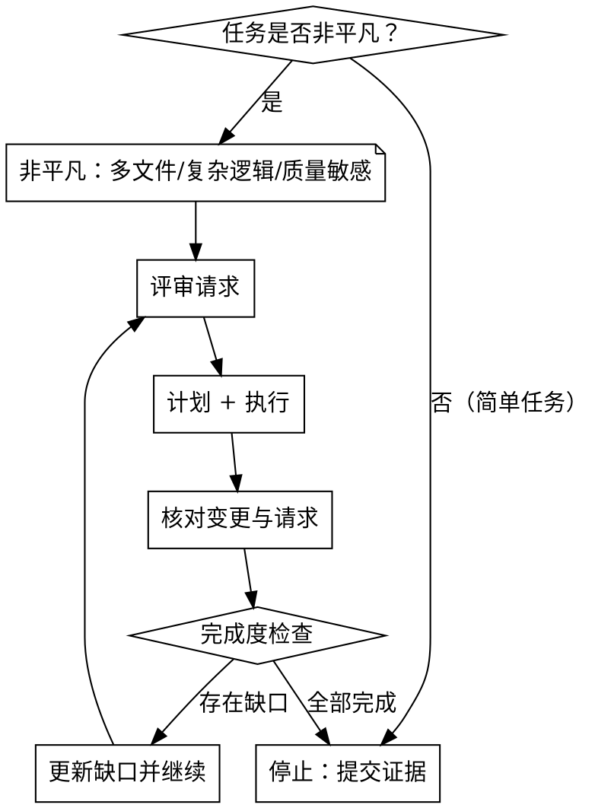

# 迭代直到完成

## 概述
严格执行"评审-计划-执行-再评审"循环，直到需求与验证全部通过。这是一个通用质量框架，适用于大多数开发任务。

## 何时使用

**默认适用：**
- 多文件改动或复杂逻辑变更
- 需要精确满足明确成功标准的任务
- 质量敏感场景（核心功能、安全相关、用户体验关键路径）
- 用户明确要求迭代或质量保证

**可选使用：**
- 简单单文件修改
- 明确的低风险改动（如文档更新、配置调整）

**不适用：**
- 纯研究/探索任务（无明确交付物）
- 纯问答/解释任务

## 建议角色
- 🏗️ **解决方案架构师**：评估每次迭代的影响和风险
- 👨‍💻 **高级开发者**：实施最小有效变更
- 🧪 **QA 工程师**：验证每次迭代的完成度

## 子技能
- **根据任务类型选择：** fix-bug（缺陷）、develop-feature（新功能）、refactor（重构）
- **REQUIRED:** verification-before-completion（每轮迭代结束后的验证）
- **OPTIONAL:** review-code（迭代间隙的代码评审）

## 迭代决策流程


## 迭代协议

### 初始评审（第 0 轮）
1. **重述请求**：成功标准、约束条件
2. **识别缺口**：缺失信息、依赖、风险
3. **任务分类**：bug / 功能 / 重构
4. **选择子技能**：fix-bug / develop-feature / refactor

### 迭代循环（第 N 轮）
1. **计划**：基于当前缺口制定本轮计划
2. **执行**：最小变更 + 必要测试
3. **验证**：运行测试/检查，记录证据
4. **评审**：对照成功标准，列出剩余缺口
5. **决策**：全部完成 → 停止；存在缺口 → 继续下一轮

### 完成度检查（每一轮必须回答）

**停止条件（缺一不可）：**
- [ ] 所有成功标准已满足
- [ ] 所有验证命令通过
- [ ] 无已知缺口或失败测试
- [ ] 无回归

**全部勾选 → 停止；任一未勾选 → 继续迭代**

**阻塞情况（停止并询问用户）：**
- 信息缺失导致无法推进
- 触发高风险确认条件
- 请求范围超出原计划且增加风险

### 迭代输出格式

每轮结束时按以下格式报告：
```markdown
## 迭代 N

### 本轮完成
- [x] 变更 1
- [x] 变更 2

### 验证结果
[粘贴命令输出]

### 完成度检查
- [ ] 成功标准已满足
- [ ] 验证命令通过
- [ ] 无已知缺口
- [ ] 无回归

### 决策
继续 / 停止
```

## 示例

### 示例 1：Bug 修复迭代

**请求：** "登录返回 500 错误，帮我修复"

**迭代 1：**
- 计划：添加失败测试复现问题 → 定位根因 → 最小修复
- 执行：发现 `user` 可能为 `undefined`，添加空值检查
- 验证：基础登录测试通过
- 缺口：过期 token 场景未测试
- 决策：继续

**迭代 2：**
- 计划：添加过期 token 测试 → 验证边界情况
- 执行：补充测试，发现仍返回 500，修复
- 验证：所有测试通过
- 缺口：无
- 决策：停止

### 示例 2：功能开发迭代

**请求：** "给报表页加 CSV 导出"

**迭代 1：**
- 计划：调研现有工具 → 实现客户端导出 → 添加测试
- 执行：实现基础导出，支持当前页数据
- 验证：功能可用
- 缺口：大数据量性能未验证，权限检查缺失
- 决策：继续

**迭代 2：**
- 计划：添加行数限制 → 集成现有权限检查 → 性能测试
- 执行：限制 10k 行，复用 `/reports` 权限
- 验证：10k 行导出 <2s，权限正确
- 缺口：无
- 决策：停止

## 常见错误

### 流程违规
- 以"很简单"为由跳过迭代
- 一次迭代后未完成度检查就停止
- 无验证证据就宣称完成
- 忽略缺失信息并猜测需求

### 迭代质量
- 每轮迭代无明确目标
- 不更新缺口清单就重复执行
- 验证失败仍继续下一轮
- 引入新问题但未修复就声称完成

### 与子技能协调
- 调用 fix-bug/develop-feature 但不遵循其协议
- 迭代时偏离子技能的核心原则（如 fix-bug 的最小变更）

## 借口 vs 事实

| 借口 | 事实 |
| --- | --- |
| "任务很简单，不需要迭代" | 简单也需完成度检查；一过性执行容易遗漏。 |
| "用户没要求 loop" | 默认适用于非平凡任务，无需明确要求。 |
| "迭代太慢了" | 一次性返工比多次迭代更慢。 |
| "我已经检查过了" | 每轮都必须重新评审，缺口可能累积。 |
| "差不多行了" | 仅当全部完成条件满足时才能停止。 |
| "缺信息先猜测" | 信息缺失必须询问，猜测导致返工。 |

## 红旗 - 立刻停止

以下行为违反迭代协议，必须立刻纠正：

- **跳过完成度检查**：迭代后不验证就声称完成
- **无证据宣称完成**：最终回复缺少验证输出
- **带缺口停止**：迭代结束时仍有已知问题或失败测试
- **高风险未确认**：执行破坏性/安全变更前未征得同意
- **重复无效迭代**：未更新缺口清单就重复相同操作
- **忽视子技能协议**：调用 fix-bug/develop-feature 但不遵循其核心原则

## 高风险确认条件

触发以下情况时，必须在执行前明确获得用户批准：

- 破坏性或不可逆操作（数据删除、历史重写、破坏性迁移）
- 安全、鉴权、访问控制或敏感数据处理变更
- 破坏 API 契约或兼容性风险
- 范围超出既定计划且增加了风险
