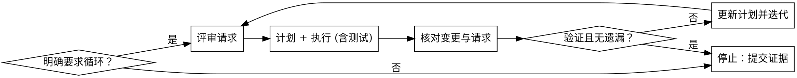

# 循环直到完成

## 概述
严格执行“评审-计划-执行-再评审”循环，直到需求与验证全部通过；仅在需要用户输入时停。

## 触发门槛
- 仅在用户明确要求循环或迭代时使用。
- 若请求不明确，不应用此技能。

## 必需子技能
- **REQUIRED SUB-SKILL:** fix-bug（bug、回归、错误输出）
- **REQUIRED SUB-SKILL:** develop-feature（新功能或增强）
- **REQUIRED SUB-SKILL:** verification-before-completion
- **OPTIONAL:** review-code（评审阶段）

## 循环决策流程

## 循环协议
1. 评审请求：重述成功标准与约束；识别缺失信息。
2. 分类任务：bug vs 功能；调用对应子技能。
3. 编写计划：步骤、测试、验证命令。
4. 执行计划：最小变更，并补齐必要测试。
5. 评审变更：对照请求列出缺口/回归。
6. 验证：运行测试/命令并记录证据。
7. 决策：仍有缺口/失败 → 更新计划继续迭代。

## 停止条件
仅在全部满足时停止：
- 请求已完全满足。
- 验证命令运行通过。
- 无已知遗漏、失败测试或尚未解决的问题。

遇到以下情况停止并询问用户：
- 信息缺失导致无法推进。
- 触发表中的高风险确认项。
- 请求超出了既定计划的范围且增加了风险。

## 迭代检查清单
- 重述请求与成功标准。
- 规划并按测试与验证执行。
- 评审变更与请求的一致性。
- 运行验证并报告证据。
- 决定：继续迭代或停止。

## 快速参考
| 阶段 | 输出 |
| --- | --- |
| 评审 | 成功标准 + 缺失信息 |
| 计划 | 步骤 + 测试 + 验证 |
| 执行 | 最小变更 + 必要测试 |
| 复审 | 与请求的差距清单 |
| 验证 | 命令输出证据 |
| 决策 | 继续迭代或停止 |

## 示例
用户："Loop until done: fix the login 500 error. Keep iterating until fixed."

迭代 1：
- 评审：将成功定义为有效登录返回 200 OK；识别缺失复现。
- 计划：为登录端点添加失败测试；运行失败；实现修复；重跑测试。
- 复审：会话 token 场景仍失败。
- 验证：单元测试失败，必须继续迭代。

迭代 2：
- 更新计划：增加会话 token 边界测试；实现修复。
- 验证：全部测试通过，无缺口。
- 停止：报告证据与输出。

## 常见错误
- 以“很小”为由跳过计划
- 一次迭代后未复审就停止
- 无验证证据就宣称完成
- 忽略缺失信息并猜需求
- 不更新计划或证据就反复循环

## 借口 vs 事实
| 借口 | 事实 |
| --- | --- |
| “用户说跳过计划” | 计划是必须的；可简短但不能跳过。 |
| “测试可以后跑” | 没有验证就不能声称完成。 |
| “我已经复审过一次” | 每次迭代都必须复审。 |
| “差不多就行” | 仅当需求与验证通过时才能结束。 |
| “缺信息没关系” | 停止并询问，不要猜。 |

## 红旗 - 立刻停止
- 执行前没有计划
- 最终回复缺少验证证据
- 迭代结束仍有已知缺口或失败测试
- 高风险变更无明确确认
- 未新增证据就重复同一迭代
